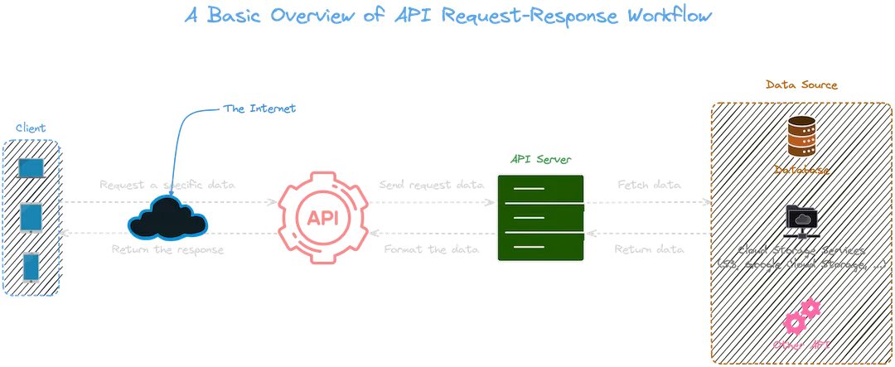
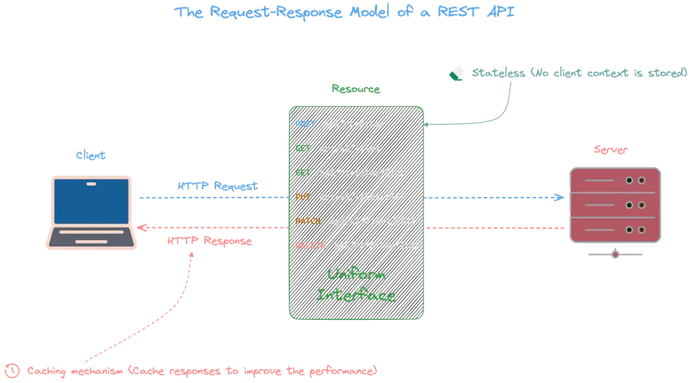
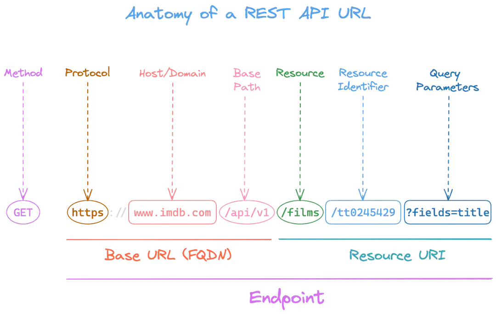
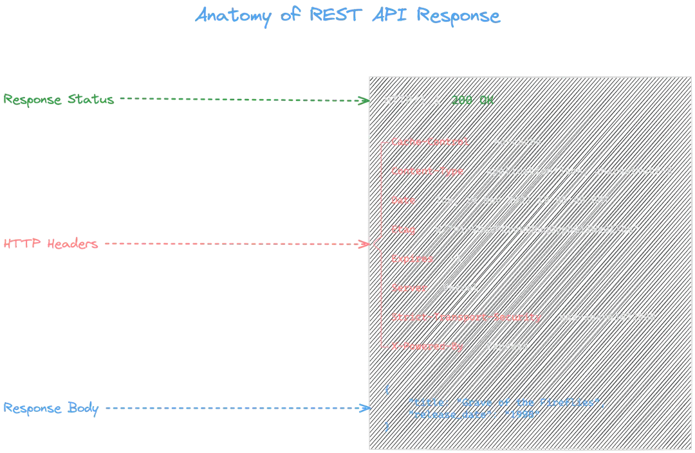
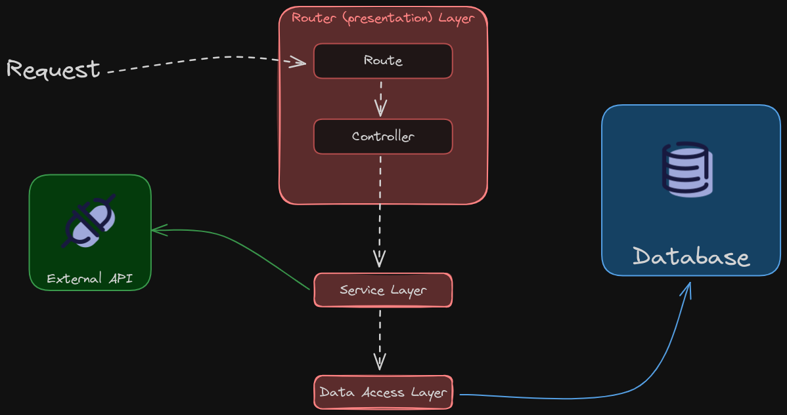

# Guida ai Concetti REST API con Node.js e TypeScript

Questa guida spiega i concetti fondamentali delle REST API e le best practice attuali per lo sviluppo di servizi REST con TypeScript e Node.js.

## Cosa succede quando invii una richiesta HTTP?



Quando un client (browser, app mobile, cURL) invia una richiesta HTTP, questa attraversa diversi strati prima di ricevere una risposta:

1. Il client costruisce la richiesta (metodo, URL, headers, body)
2. La richiesta raggiunge il server attraverso la rete
3. Il framework web (Hono) la instrada al handler corretto
4. I middleware processano la richiesta (validazione, autenticazione, logging)
5. Il controller esegue la logica di business
6. Il server costruisce e invia la risposta al client

## Modello Request-Response nelle REST API



Le REST API si basano sul modello **request-response stateless**: ogni richiesta è indipendente e contiene tutte le informazioni necessarie per essere processata. Il server non mantiene stato tra una richiesta e l'altra.

### Principi REST fondamentali

- **Stateless**: Ogni richiesta è autonoma, il server non conserva sessioni
- **Resource-based**: Le URL rappresentano risorse (es. `/tasks`, `/tasks/1`)
- **Metodi HTTP uniformi**: GET (lettura), POST (creazione), PUT (sostituzione), PATCH (modifica parziale), DELETE (eliminazione)
- **Rappresentazione**: Le risorse vengono scambiate in formato JSON (o altri formati)

## Anatomia di un URL



| Componente | Esempio | Descrizione |
|------------|---------|-------------|
| **Schema** | `https://` | Protocollo di comunicazione |
| **Host** | `api.example.com` | Dominio del server |
| **Port** | `:3000` | Porta (opzionale, default 80/443) |
| **Path** | `/tasks/1` | Percorso alla risorsa |
| **Query** | `?completed=true&limit=10` | Parametri di filtro/paginazione |

### Convenzioni per i path REST

```
GET    /tasks          → Lista risorse (collection)
GET    /tasks/:id      → Singola risorsa
POST   /tasks          → Crea nuova risorsa
PUT    /tasks/:id      → Sostituisci risorsa
PATCH  /tasks/:id      → Modifica parziale
DELETE /tasks/:id      → Elimina risorsa
```

**Best practice**: usare nomi plurali (`/tasks` non `/task`), sostantivi (non verbi), e struttura gerarchica per risorse annidate (`/projects/:id/tasks`).

## Anatomia di una risposta HTTP



Una risposta HTTP è composta da:

- **Status Line**: codice di stato + messaggio (es. `200 OK`)
- **Headers**: metadati (`Content-Type`, `Cache-Control`, ecc.)
- **Body**: contenuto della risposta (tipicamente JSON)

### Formato risposte consistente

Una best practice fondamentale è mantenere un formato di risposta uniforme in tutta l'API:

```typescript
// Risposta di successo
interface ApiResponse<T> {
  data: T;
}

// Risposta con messaggio (es. creazione)
interface ApiMessageResponse<T> {
  message: string;
  data: T;
}

// Risposta di errore
interface ApiErrorResponse {
  error: string;
  message: string;
  timestamp: string;
  details?: Array<{ field: string; message: string }>;
}
```

## Codici di stato HTTP


| Codice | Significato | Uso tipico |
|--------|-------------|------------|
| **200** | OK | Richiesta riuscita (GET, PUT, PATCH) |
| **201** | Created | Risorsa creata con successo (POST) |
| **204** | No Content | Operazione riuscita senza body (DELETE) |
| **400** | Bad Request | Input non valido, errore di validazione |
| **404** | Not Found | Risorsa non trovata |
| **409** | Conflict | Conflitto (es. risorsa duplicata) |
| **422** | Unprocessable Entity | Semanticamente non valido |
| **500** | Internal Server Error | Errore lato server |

**Best practice**: usare i codici appropriati per ogni situazione. Non restituire `200` con un messaggio di errore nel body.

## Architettura di una REST API


---



### Architettura a livelli (Layers)

Una REST API ben strutturata separa le responsabilità in livelli distinti:

```text
┌──────────────────────────────────────┐
│          HTTP Layer                  │
│  Framework (Hono), Routing, CORS,    │
│  Security Headers                    │
├──────────────────────────────────────┤
│          Middleware Layer            │
│  Validazione (Zod), Autenticazione,  │
│  Logging, Rate Limiting              │
├──────────────────────────────────────┤
│          Controller Layer            │
│  Logica di business, orchestrazione, │
│  formattazione risposte              │
├──────────────────────────────────────┤
│          Data Access Layer           │
│  Query database, prepared statements,│
│  mapping risultati                   │
├──────────────────────────────────────┤
│          Database                    │
│  SQLite, PostgreSQL, MySQL, etc.     │
└──────────────────────────────────────┘
```

Ogni livello comunica solo con quello immediatamente adiacente. Questo garantisce:

- **Testabilità**: ogni livello può essere testato in isolamento
- **Manutenibilità**: modifiche ad un livello non impattano gli altri
- **Riusabilità**: i componenti sono intercambiabili

### Layers vs Tiers

È importante distinguere tra *layers* (livelli logici) e *tiers* (livelli fisici):

- **Layers**: separazione logica nel codice (routing, controller, data access)
- **Tiers**: separazione fisica dell'infrastruttura (client, server, database)

In un'architettura [three-tier](https://www.ibm.com/topics/three-tier-architecture):

| Tier | Ruolo | Esempio |
|------|-------|---------|
| **Presentation** | Interfaccia utente | Browser, app mobile, SPA |
| **Application** | Logica di business | Node.js + Hono (questa API) |
| **Data** | Persistenza dati | SQLite, PostgreSQL |

## Best Practice per REST API con TypeScript

### 1. Validazione input con Zod

Zod è lo standard attuale per la validazione in TypeScript: definisce lo schema una sola volta e ne deriva automaticamente il tipo.

```typescript
import { z } from 'zod';

// Schema = validazione runtime + tipo TypeScript
export const createTaskSchema = z.object({
  title: z.string().trim().min(1).max(200),
  description: z.string().trim().max(1000).nullable().optional(),
  priority: z.enum(['low', 'medium', 'high']).optional().default('medium')
});

// Il tipo viene inferito dallo schema — singola fonte di verità
type CreateTaskInput = z.infer<typeof createTaskSchema>;
```

**Perché è importante**: elimina la duplicazione tra tipi e validazione, e garantisce che i dati in ingresso siano sempre conformi al tipo atteso.

### 2. Type safety end-to-end

TypeScript deve coprire tutto il flusso, dalla richiesta alla risposta:

```typescript
// Tipi del dominio
export type Priority = 'low' | 'medium' | 'high';

export interface Task {
  id: number;
  title: string;
  description: string | null;
  completed: number;
  priority: Priority;
  created_at: string;
  updated_at: string;
}

// Risposte tipizzate
return c.json<ApiResponse<Task>>({ data: task });
return c.json<ApiMessageResponse<Task>>({ message: 'Creato', data: newTask }, 201);
return c.json<ApiErrorResponse>({ error: 'Not Found', ... }, 404);
```

**Vantaggi**: errori catturati a compile-time, autocomplete nell'IDE, refactoring sicuro.

### 3. Middleware riutilizzabili e componibili

Il pattern middleware permette di comporre funzionalità in modo modulare:

```typescript
// Middleware generico per validazione body
function validateBody<T extends z.ZodTypeAny>(schema: T) {
  return async (c: Context, next: Next) => {
    const body = await c.req.json();
    const result = schema.safeParse(body);
    if (!result.success) {
      return c.json<ApiErrorResponse>(formatErrors(result.error), 400);
    }
    c.set('validatedBody', result.data);
    await next();
  };
}

// Uso nella route: composizione pulita
tasks.post('/', validateBody(createTaskSchema), createTask);
```

### 4. Gestione errori centralizzata

Un singolo error handler globale invece di try/catch ripetuti in ogni controller:

```typescript
// Classe errore personalizzata
class HttpError extends Error {
  constructor(public statusCode: number, message: string) {
    super(message);
  }
}

// Error handler globale (Hono)
app.onError((err, c) => {
  if (err instanceof HttpError) {
    return c.json<ApiErrorResponse>({
      error: err.message,
      message: err.message,
      timestamp: new Date().toISOString()
    }, err.statusCode);
  }
  // Errori inaspettati: log + risposta generica
  console.error(err);
  return c.json<ApiErrorResponse>({ ... }, 500);
});
```

### 5. Sicurezza

Pratiche essenziali per ogni REST API in produzione:

| Pratica | Implementazione | Scopo |
|---------|----------------|-------|
| **Security Headers** | `secureHeaders()` di Hono | XSS, clickjacking, sniffing |
| **CORS** | `cors()` di Hono | Controllo origini cross-origin |
| **Validazione input** | Zod schemas | Prevenire dati malformati |
| **Prepared Statements** | `db.prepare('... WHERE id = ?')` | Prevenire SQL injection |
| **Rate Limiting** | Middleware dedicato | Prevenire abuso/DoS |
| **Container non-root** | `USER node` nel Dockerfile | Principio del minimo privilegio |

### 6. Struttura del progetto

Due approcci principali per organizzare il codice:

#### Per ruolo tecnico (consigliato per progetti piccoli/medi)

```bash
src/
├── controllers/        # Logica di business
│   └── taskController.ts
├── middleware/          # Validazione, errori, auth
│   ├── errorHandler.ts
│   └── validate.ts
├── routes/             # Definizione endpoint
│   └── taskRoutes.ts
├── config/             # Configurazione (database, env)
│   └── database.ts
├── types/              # Definizioni di tipo
│   └── index.ts
└── app.ts              # Entry point
```

Questa struttura è quella adottata in questo progetto. È semplice, chiara e si scala bene fino a un numero moderato di risorse.

#### Per componente di business (consigliato per progetti grandi)

```bash
src/
├── modules/
│   ├── tasks/
│   │   ├── task.controller.ts
│   │   ├── task.routes.ts
│   │   ├── task.schema.ts
│   │   ├── task.service.ts
│   │   └── task.types.ts
│   ├── projects/
│   │   ├── project.controller.ts
│   │   ├── project.routes.ts
│   │   └── ...
├── shared/             # Middleware, utilities condivise
│   ├── middleware/
│   └── types/
└── app.ts
```

Questo approccio raggruppa tutto ciò che riguarda una risorsa nello stesso modulo. È più scalabile quando il numero di risorse cresce, ma introduce più complessità strutturale.

**Non esiste una soluzione universale**: la scelta dipende dalla dimensione e dai requisiti specifici del progetto.

### 7. Framework moderni: Hono

Hono rappresenta la nuova generazione di framework web per TypeScript:

| Caratteristica | Hono | Express |
|---------------|------|---------|
| **Dimensione** | ~14KB | ~200KB |
| **TypeScript** | First-class, built-in | Richiede `@types/express` |
| **Middleware** | CORS, headers, logger built-in | Pacchetti separati (helmet, cors, morgan) |
| **Runtime** | Node, Bun, Deno, Cloudflare Workers | Solo Node.js |
| **Performance** | Ottimizzato | Standard |

### 8. Ulteriori best practice

- **ES Modules**: usare `import`/`export` invece di `require`/`module.exports`
- **Strict TypeScript**: abilitare `strict: true` in `tsconfig.json`
- **Paginazione**: sempre su endpoint che restituiscono liste
- **Logging strutturato**: usare middleware di logging per tracciare ogni richiesta
- **Health check**: endpoint `/health` per monitoring e orchestrazione container
- **Graceful shutdown**: chiudere connessioni database e server in modo pulito
- **Environment variables**: configurazione esternalizzata, mai hardcoded
- **Docker multi-stage**: build ottimizzata per immagini leggere in produzione
